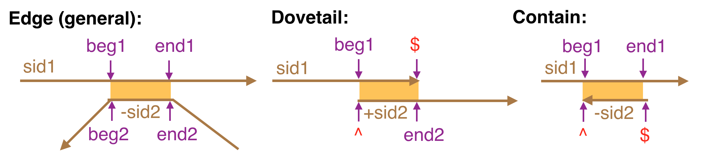
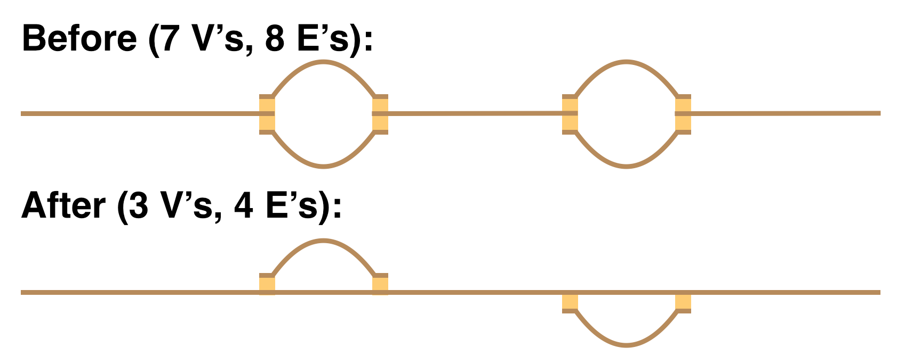

# **GFA2: A Propsal (Verse 1.1)**
## *J. Chin, R.Durbin, G. Myers*
## *Aug. 31, 2016*

## PROLOG

GFA2 is a superset of GFA that allows one to specify an assembly graph in either less detail,
e.g. just the topology of the graph, or more detail, e.g. the multi-alignment of reads giving
rise to each sequence.  We further designed it to be a suitable representation for a string
graph at any stage of assembly, from the graph of all overlaps, to a final resolved assembly
of contig paths with multi-alignments.  Apart from meeting our needs, the extensions also
supports other assembly and variation graph types.

We futher want to emphasize that we are proposing a core standard.  As will be seen later in
the technical specification, the format is **extensible** in that additional description lines
can be added and additional SAM tags can be appended to core description lines.

In overview, an assembly is a graph of vertices called **segments** representing sequences
that are connected by **edges** that denote local alignments between the vertex sequences.
At a minimum one must specify the length of the sequence represented, further specifying the
actual sequence is optional.  In the direction of more detail, one can optionally specify a
collection of external sequences, called **fragments**, from which the sequence was derived (if
applicable) and how they multi-align to produce the sequence.  Similarly, the specification
of an edge need only describe the range of base pairs aligned in each string, and optionally
contain a **trace** or a **CIGAR string** to describe the alignment of the edge.  Traces are a
space-efficient Dazzler assembler concept that allow one to efficiently reconstruct an
alignment in linear time, and CIGAR strings are a SAM concept explicitly detailing the
columns of an alignment.  Many new technologies such a Hi-C and BioNano maps organize segments
into scaffolds along with traditional data sets involving paired reads, and so a “gap” edge
concept is also introduced so that order and orientaiton between disjoint contigs of an
assembly can be described.

## GRAMMAR

```
<spec>    <- <header> ( <segment> | <edge> | <gap> | <group> )+

<header>  <- H VN:Z:2.0 {TS:i:<trace spacing>}

<segment> <- <simple> | <multi> <fragment>^NF
 
   <multi>  <- S <sid:int> <slen:int> <sequence> NF:i:<int> 
 
   <simple> <- S <sid:int> <slen:int> <sequence>

   <fragment> <- F <sid:int> [+-] <fid:int>
                     <sbeg:int> <send:int> {CL:B:<pbeg>,<pend>,<plen>} {<alignment>}

<edge>  <- E {@<edge_id>} <sid1:int> [+-] <sid2:int>
                            <beg1:pos> <end1:pos> <beg2:pos> <end2:pos> {<alignment>}

<gap>   <- G <sid1:int> [+-] <sid2:int> <dist:int> <var:int>

<group> <- P <name:string> (<sid> | @<eid>) ( {,} (<sid> | @<eid>)) +

    <pos>       <- ^ | <int> | $
    <sequence>  <- * | [A-Za-z]+
    <alignment> <- TR:B:<trace array>
                   CG:Z:<CIGAR string>

      <CIGAR string> <- ([1-9][0-9]*[MX=ID])*
      <trace array>  <- <int>(,<int>)*
```

In the grammar above all symbols are literals other than tokens between <>, the derivation
operator <-, and the following marks:
  * {} enclose an optional item
  * | denotes an alternative
  * * zero-or-more
  * + one-or-more
  * [] a set of one character alternatives.

Each descriptor line must begin with a letter and lies on a single line with no white space
before the first symbol.   The tokens that generate descriptor lines are \<header\>, \<multi\>,
\<simple\>, \<fragment\>, \<edge\>, \<gap\>, and \<group\>.
Any line that does not begin with a recognized code (i.e. H, S, F, E, or G) can be ignored.
This will allow users to have additional descriptor lines specific to their special processes.
Moreover, the suffix of any GFA2 descriptor line may contain any number of user-specific SAM
tags which are ignored by software designed to support the core standard.  These user-specific
tags must occur after any of the optional SAM tags in the core specification above
(i.e. VN, TS, TR, CG, NF, and CL).  

## SEMANTICS

The header just contains a version number, 2.0, and if Dazzler trace points are used to
efficiently encode alignments, then one needs to specify the trace point spacing with a
TS tag in the header.

A segment is specified by either a single S-line without an NF-tag or an S-line with the tag
followed immediately by NF F-lines.  This and the fact that the header must occur first are the
only order requirements for GFA2 files. The S-line gives a user-specified integer id for the
sequence, its length in bases, the string of bases denoted by the segment or * if absent, and
the number of fragments that immediately follow if relevant.

Fragments, if present, are encoded in F-lines that give (a) the segment they belong to, (b) the
orientation of the fragment to the segment, (c) an external integer id that references a sequence
in an external collection (e.g. a database of reads or segments in another GFA2 or SAM file),
and (d) the interval of the vertex segment that the external string contributes to.  One can
optionally give a trace or CIGAR string detailing the alignment, and optionally specify, should
clipping/trimming the fragment sequence be necessary, what portion of the fragment is used and
its length with a CL-tag.

Edges are encoded in E-lines that in general represent a local alignment between arbitrary
intervals of the sequences of the two vertices in question. One gives the segment id’s of
the two vertices and a + or – sign between them to indicate whether the second segment should
be complemented or not.  A CIGAR string (or trace) describing the alignment is optional, but
one must give the intervals that are aligned as a pair of positions where a position can have
the special value ^ denoting the beginning of the segment, or the special value $ denoting
the end of the segment.  An edge may optionally be given a unique integer ID in the case that
a user needs to explicitly refer to it in group line (see below).  This is specified by
optionally giving the id prefixed with an @-sign at the start of the line.

The GFA2 concept of edge generalizes the link and containment lines of GFA.  For example a GFA
edge which encodes what is called a dovetail overlap (because two ends overlap) is simply a GFA2
edge where end1 = $ and beg2 = ^ or beg1 = ^ and end2 = $.   A GFA containment is
modeled by the case where beg2 = ^ and end2 = $ or beg1 = ^ and end1 = $.  The figure
below illustrates:



Special codes could be adopted for dovetail and containment relationships but the thought is
there is no particular reason to do so, the use of the special characters for terminal positions
makes their identification simple both algorithmically and visually, and the more general
scenario allows interesting possibilities.  For example, one might have two haplotype bubbles
shown in the “Before” picture below, and then in a next phase choose a path through the
bubbles as the primary “contig”, and then capture the two buble alternatives as a vertex
linked with generalized edges shown in the “After” picture.  Note carefully that you need a
generalized edge to capture the attachment of the two haplotype bubbles in the “After” picture.


 
While one has graphs in which vertex sequences actually overlap as above, one also frequently
encounters models in which there is no overlap (basically edge-labelled models captured in a
vertex-labelled form).  This is captured by edges for which beg1 = end1 and beg2 = end2 (i.e.
0-length overlap)!

While not a concept for pure DeBrujin or long-read assemblers, it is the case that paired end
data and external maps often order and orient contigs/vertices into scaffolds with
intervening gaps.  To this end we introduce a “gap” edge described in G-lines that give the
estimated gap distance between the two vertex sequences and the variance of that estimate.

A group encoding on a P-line (P for path from GFA) allows one to specify a named subgraph of
the overall graph.  Such a collection could for example be hilighted by a drawing program on
command, or might specify decisionts about tours through the graph.  A P-line begins with the
name for the collection which may be any string of non-white space characters.  This is then
followed by a list of segment id's and/or edge id's prefixed by an @-symbol where the list
is either white-space or comma separated.  If white-space separated, then the collection
refers to the subgraph implied by the collection (i.e. all edges between listed segments and
all segments adjacent to listed edges are included).  If comma-separated, then the subgraph
only contains edges between consecutive pairs of segments in the list (as opposed to all
pairs).  This later form, allows the specification of a path through the graph.  Note carefully
that there may be several edges between a given pair of segments, so in the event you want
to refer to a specific you must give the edge an ID in its definition and then refer to the
ID.  However, this is typically not the case and edge ID's are not needed.

## EXTENSIONS TO THE CORE

As mentioned above, the format is extensible by users with the intention that the specification
above defines a "core" that all tools should support.  Therefore, the question is not to support
every variant that one might desire but to support those viewed as essential.

For example, if the consensus is that trace points are just a “Gene thing” then they could
be removed from the standard and I will put them in my GFA files as an optional user-specific
SAM tag.

As another example, if people still love the L- and C-lines of the GFA format (which have
been consolidated and generalized in the E-line of GFA2), then one could certainly support
extension in which those lines are understood by supporting tools.
