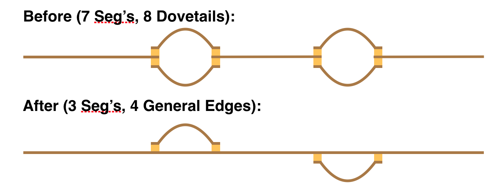

# Graphical Fragment Assembly (GFA) 2.0 Format Specification

## Prolog

GFA2 is a generalization of GFA that allows one to specify an assembly graph in either less detail,
e.g. just the topology of the graph, or more detail, e.g. the multi-alignment of reads giving
rise to each sequence.  It is further designed to be a able to represent a string
graph at any stage of assembly, from the graph of all overlaps, to a final resolved assembly
of contig paths with multi-alignments.  Apart from meeting these needs, the extensions also
supports other assembly and variation graph types.

The proposal is for a *core standard*.  As will be seen later in
the technical specification, the format is **extensible** in that additional description lines
can be added and additional SAM tags can be appended to core description lines.

In overview, an assembly is a graph of vertices called **segments** representing sequences
that are connected by **edges** that denote local alignments between the vertex sequences.
At a minimum one must specify the length of the sequence represented, further specifying the
actual sequence is optional.  In the direction of more detail, one can optionally specify a
collection of external sequences, called **fragments**, from which the sequence was derived (if
applicable) and how they multi-align to produce the sequence.  Similarly, the specification
of an edge need only describe the range of base pairs aligned in each string, and optionally
contain a [**Dazzler-trace**](http://wp.me/p4o3kW-88)
or a [**CIGAR string**](https://samtools.github.io/hts-specs/SAMv1.pdf)
to describe the alignment of the edge.  Traces are a
space-efficient Dazzler assembler concept that allow one to efficiently reconstruct an
alignment in linear time, and CIGAR strings are a SAM concept explicitly detailing the
columns of an alignment.  Many new technologies such a Hi-C and BioNano maps organize segments
into scaffolds along with traditional data sets involving paired reads, and so a **gap** edge
concept is also introduced so that order and orientation between disjoint contigs of an
assembly can be described.  Finally, one can describe and attach a name to any **path** or
**subgraph** in the encoded string graph.

## Grammar

```
<spec>     <- ( <header> | <segment> | <fragment> | <edge> | <gap> | <group> )+

<header>   <- H {VN:Z:2.0} {TS:i:<trace spacing>} <tag>*

<segment>  <- S <sid:id> <slen:int> <sequence> <tag>*

<fragment> <- F <sid:id> <external:ref>
                  <sbeg:pos> <send:pos> <fbeg:pos> <fend:pos> <alignment> <tag>*

<edge>     <- E <eid:opt_id> <sid1:ref> <sid2:ref>
                          <beg1:pos> <end1:pos> <beg2:pos> <end2:pos> <alignment> <tag>*

<gap>      <- G <gid:opt_id> <sid1:ref> <sid2:ref> <dist:int> (* | <var:int>) <tag>*

<group>    <- <o_group> | <u_group>

  <o_group>  <- O <oid:opt_id> <ref>([ ]<ref>)* <tag>*
  <u_group>  <- U <uid:opt_id>  <id>([ ]<id>)*  <tag>*

    <id>        <- [!-~]+
    <ref>       <- <id>[+-]
    <opt_id>    <- <id> | *

    <tag>       <- [A-Za-z0-9][A-Za-z0-9]:[ABHJZif]:[ -~]*

    <pos>       <- <int>{$}
    <int>       <- [0-9]+

    <sequence>  <- * | [!-~]+
    <alignment> <- * | <trace> | <CIGAR>

      <CIGAR> <- ([0-9]+[MDIP])+
      <trace> <- <int>(,<int>)*
```

In the grammar above all symbols are literals other than tokens between <>, the derivation
operator <-, and the following marks:

  * {} enclose an optional item
  * | denotes an alternative
  * \* zero-or-more
  * \+ one-or-more
  * [] a set of one character alternatives.

Like GFA, GFA2 is tab-delimited in that every lexical token is separated from the next
by a single tab.

Each record line must begin with a letter and lies on a single line with no white space
before the first symbol.   The tokens that generate record lines are \<header\>, \<segment\>,
\<fragment\>, \<edge\>, \<gap\>, and \<group\>.
Any line that does not begin with a recognized code (i.e. H, S, F, E, G, O, or U) can be ignored.
This will allow users to have additional record lines specific to their special processes.
Moreover, the suffix of any GFA2 record line may contain any number of user-specific SAM
tags which may be ignored by software designed to support the core standard.  Tags with lower-case
letters are reserved for end-users.

There is one name space for all identifiers for segments, edges, gaps,
and groups.  External fragment ID's are assumed to be in a distinct name space.  It is
an error for any identifier to be used twice in a defining context.  Note carefully that
instead of an identifier, one can use a * for edges, gaps, and groups, implying that an
id is not needed as the item will not be referred to elsewhere in the file.  Moreover,
almost all references to identifiers are oriented, by virtue of a post-fix + or - sign.
A +-sign indicates the object is in the orientation it was defined, and a --sign indicates
it should be reverse-complemented.

## Semantics

### Header

The **header** contains an optional 'VN' SAM-tag version number, 2.0, and an optional
'TS' SAM-tag specifying the default the trace point spacing for any Dazzler traces specified
to accelerate alignment computation.
Any number of header lines containing SAM-tags may occur.
A 'TS' tag can occur after the fixed arguments on any E-, G-, or F-line in which case it specifies
the trace spacing to use with the trace on that specific line, otherwise the default spacing is
used.

### Segment

A **segment** is specified by an S-line giving a user-specified ID for the
sequence, its length in bases, and the string denoted by the segment or * if absent.
The sequence is typically expected to be bases or IUPAC characters, but GFA2 places
no restriction other than that they be printable characters other than space.
The length does not need to be the actual length of the sequence, if the sequence is given, but rather
an indication to a drawing program of how long to draw the representation of the segment.
The segment sequences and any CIGAR strings referring to them if present follow the
*unpadded* SAM convention.

### Fragment

**Fragments**, if present, are encoded in F-lines that give (a) the segment they belong to,
(b) an oriented external ID that references a sequence
in an external collection (e.g. a database of reads or segments in another GFA2 or SAM file),
(c) the interval of the vertex segment that the external string contributes to, and (d)
the interval of the fragment that contributes to the segment.  One concludes with either a
trace or CIGAR string detailing the alignment, or a \* if absent.

### Edge

**Edges** are encoded in E-lines that in general represent a local alignment between arbitrary
intervals of the sequences of the two vertices in question. One gives first an edge ID or * and
then the *oriented* segment ID’s of the two vertices involved.

One then gives the intervals of each segment that align, each as a pair of *positions*.  A position
is an integer optionally followed by a $-sign.  Positions are conceptually tick-marks *between*
symbols starting a 0 to the left of the first symbol and ending at *L* to the right of the last
symbol where *L* is the length of the segment.  A $-sign must follow an integer *x* if and only if
it is the last position in the segment it refers to, i.e. *x* = *L*.  It is an error to do
otherwise.

Position intervals are always intervals in the segment in its normal
orientation *before being oriented by the orientation signs*.  If a minus sign is specified,
then the interval of the second segment is
reverse complemented in order to align with the interval of the first segment.  That is,
<code>E * s1+ s2- b1 e1 b2 e2</code> aligns s1[b1,e1] to the reverse complement of s2[b2,e2].

A field for a 
[**CIGAR string**](https://samtools.github.io/hts-specs/SAMv1.pdf)
or [**Dazzler-trace**](http://wp.me/p4o3kW-88)
describing the alignment is last, but may be absent
by giving a \*.  One gives a CIGAR string to describe an exact alignment relationship between
the two segments.  A trace string by contrast is given when one simply wants an accelerated
method for computing an alignment between the two intervals.
A trace is a list of integers separated by commas, each integer giving the # of characters in
the second segment to align to the next *TS* characters in the first segment where
the *TS* is either the default trace spacing given in a header line with the TS SAM-tag, or
the spacing given in a TS SAM-tag on the line of the edge.
If a \* is given as the alignment
note that it is still possible to compute the implied alignment from the sequences.

The GFA2 concept of edge generalizes the link and containment lines of GFA.  For example a GFA
edge which encodes what is called a dovetail overlap (because two ends overlap) is a GFA2
edge where either beg1 = 0 or end1 = x$ and either beg2 = 0 or end2 = y$.
A GFA containment is modeled by the case where either beg1 = 0 and end1 = x$ or beg2 = 0
and end2 = x$. The figure below illustrates:


Special codes could be adopted for dovetail and containment relationships but the thought is
there is no particular reason to do so, the use of the $ sentinel for terminal positions
makes their identification simple both algorithmically and visually, and the more general
scenario allows interesting possibilities.  For example, one might have two haplotype bubbles
shown in the “Before” picture below, and then in a next phase choose a path through the
bubbles as the primary “contig”, and then capture the two bubble alternatives as a vertex
linked with generalized edges shown in the “After” picture.  Note carefully that you need a
generalized edge to capture the attachment of the two haplotype bubbles in the “After” picture.


 
While one has graphs in which vertex sequences actually overlap as above, one also frequently
encounters models in which there is no overlap (basically edge-labelled models captured in a
vertex-labelled form).  This is captured by edges for which beg1 = end1 = x$ and beg2 = end2 = 0
(i.e. 0-length overlap of the end of segment 1 and the beginning of segment 2)!

### Gap

While not a concept for pure DeBrujin or long-read assemblers, it is the case that paired end
data and external maps often order and orient contigs/vertices into scaffolds with
intervening gaps.  To this end we introduce a **gap** edge described in G-lines that give the
estimated gap distance between the two segment sequences and the variance of that estimate.
The gap is between the first segment at left and the second
segment at right where the segments are oriented according to their sign indicators.
The next integer gives the expected distance between the first and second segment in their
respective orientations, and the final field is either an integer giving the variance in this
estimate or a * indicating the variance is unknown.
Relationships in E-lines are fixed and known, where as
in a G-line, the distance is an estimate and the line type is intended to allow one to
define assembly **scaffolds**.

### Group

A **group** encoding on a U- or O-line allows one to name and specify a subgraph of the
overall graph.
Such a collection could for example be highlighted by a drawing program on
command, or might specify decisions about tours through the graph.  U-lines encode
*unordered* collections and O-lines encode *ordered* collections (defined in the next paragraph),
which we alternatively call **sets** and **paths**, respectively.
The remainder of
the line then consists of an optional ID for the collection followed by a non-empty list of ID's
referring to segments, edges, or other groups that are *separated by single spaces*
(i.e. the list is in a single column of the tab-delimited format).  In the case of paths
every reference must be oriented, and not so in a set.
A group list may refer to another group recursively.  It is an error for a U-line
and an O-line to have the same name.

An unordered collection or set defined in a U-line refers to
the subgraph induced by the vertices and edges in the collection (i.e. one adds all edges
between a pair of segments in the list and one adds all segments adjacent to edges in the
list.)   An ordered collection defined in an O-line captures paths in the graph consisting of
the listed objects
and the implied adjacent objects between consecutive objects in the list where the
orientation of the objects matters (e.g.
the edge between two consecutive segments, the segment between two consecutive edges, etc.)
A set can contain a reference to a path, but not vice versa, in which case the orientation
of the objects in the path become irrelevant.

Note: It was discussed whether U/O-lines with the same name could be considered to be concatenated together in the order in which they appear (see [#54](https://github.com/GFA-spec/GFA-spec/issues/54) and [#47](https://github.com/GFA-spec/GFA-spec/pull/47)). This multi-line path format was not included in the current version of this specification, but if people want to explore use of this structure, they can do so using a different single letter record code.

## Backward compatibility with GFA 1

GFA2 is a superset of GFA, that is, everything that can be encoded in GFA can be encoded
in GFA2, with a relatively straightforward transformation of each input line.

The syntactic conventions of GFA2 are identical to GFA, so upgrading a GFA parser to
a GFA2 parser is relatively straight forward.  Each description line begins
with a single letter and has a fixed set of fields that are tab-delimited.  The changes
are as follows:

1. There is an integer length field in S-lines.

2. The L- and C-lines have been replaced by a consolidated E-line.

3. The P-line has been replaced with U- and O-lines that encode subgraphs and paths, respectively,
   and can take edge id's, obviating the need for orientation signs and alignments between segments.

4. There is a new F-line for describing multi-alignments and a new G-line for describing scaffolds.

5. Alignments can be trace length sequences as well as CIGAR strings.

6. Positions have been extended to include a postfix $ symbol for positions representing the
   end of a read.

7. Segments, edges, and paths all have an orientation that is specified with a postfix + or -
   symbol in contexts where the orientation is needed.
