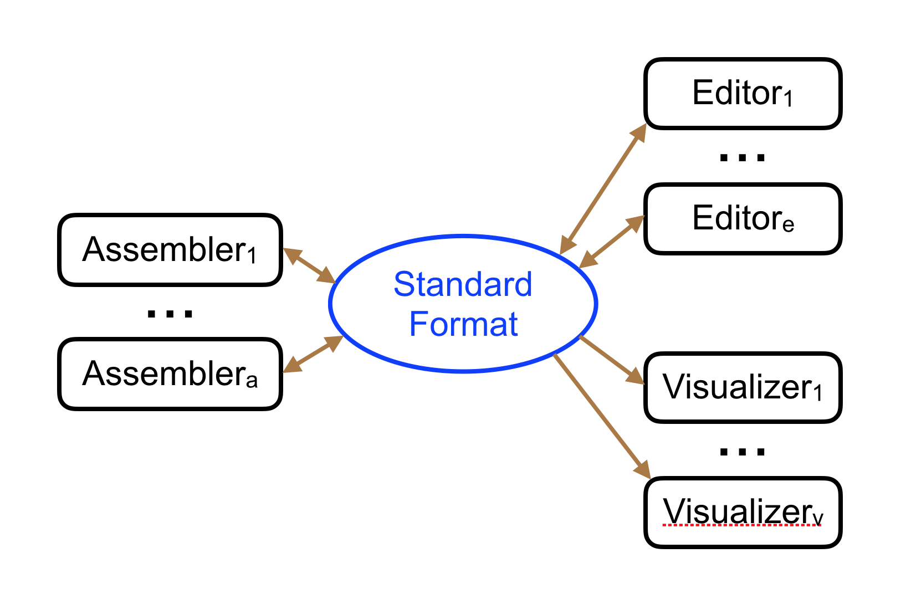

# GFA 1.0: Graphical Fragment Assembly (GFA) Format Specification 1.0

We are developing [the specification of the Graphical Fragment Assembly (GFA) format](GFA-spec.md). Your contribution is welcome. Please open up issues or submit pull requests.

The format was first suggested in a [blog post](http://lh3.github.io/2014/07/19/a-proposal-of-the-grapical-fragment-assembly-format/) by Heng Li (@lh3) and further developed in a [second post](http://lh3.github.io/2014/07/23/first-update-on-gfa/).

# Implementations

+ [ABySS](https://github.com/bcgsc/abyss)
+ [Bandage](https://rrwick.github.io/Bandage/)
+ [bfgraph](https://github.com/pmelsted/bfgraph)
+ [fermi mag2gfa](https://github.com/lh3/mag2gfa)
+ [gfakluge](https://github.com/edawson/gfakluge)
+ [gfatools](https://github.com/lh3/gfatools)
+ [jts/DALIGNER](https://github.com/jts/daligner)
+ [lmrodriguezr/gfa](https://github.com/lmrodriguezr/gfa)
+ [McCortex](https://github.com/mcveanlab/mccortex)
+ [miniasm](https://github.com/lh3/miniasm)
+ [RGFA](https://github.com/ggonnella/RGFA)
+ [vg](https://github.com/ekg/vg)
+ [TwoPaCo](https://github.com/medvedevgroup/TwoPaCo)

# Resources

+ [Examples](https://github.com/sjackman/assembly-graph) of sequence overlap graphs (assembly graphs) in a variety of formats

# GFA 2.0: Graphical Fragment Assembly (GFA) Format Specification 2.0

Jason Chin, Richard Durbin, and myself (Gene Myers) found ourselves together at a workshop
meeting in Dagstuhl Germany and hammered out an initial proposal for an assembly format.
We thought [GFA](https://github.com/pmelsted/GFA-spec) was a good start point and built a
more comprehensive
design around it.  We are calling this preliminary version the "Dagstuhl Assembly Format" or
[DAS](DAS-spec.md) and offer it up here for comment, criticism, and suggestions with the hope that
eventually some version of it might find adoption.

The reason that we want a standard is that we find that
in general, *different* development teams build assemblers, visualizers, and editors because
of the complexity and distinct nature of the three tasks.  While these tools should certainly
use tailored encodings internally for efficiency, the nexus between the three efforts
would benefit from a standard encoding format that would make them all interoperable.

The white paper is [here](DAS-spec.md)
